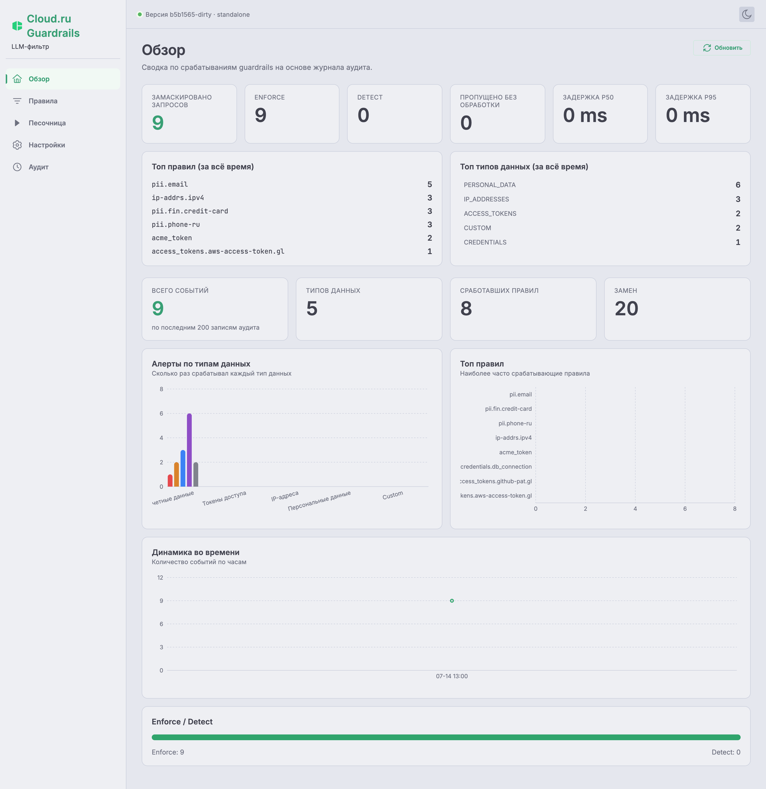
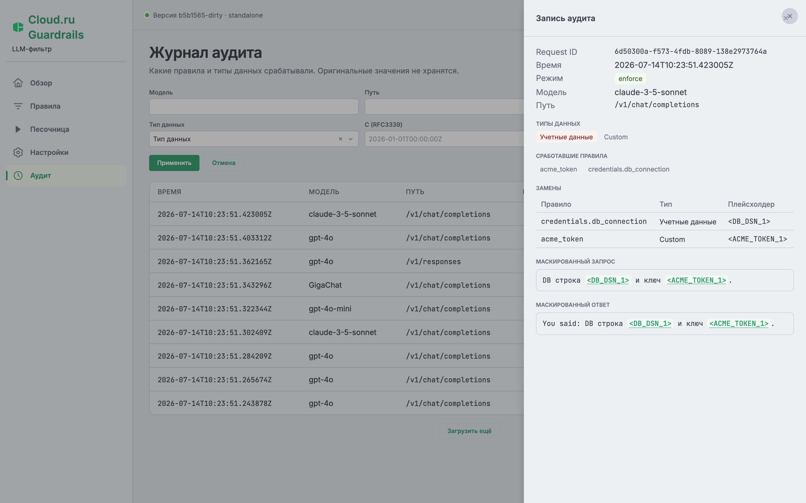

<div align="center">


# guardrails-llm-filter-extproc

**Маскирование PII и секретов в трафике к LLM — как Envoy external processor.**

Тот же движок маскирования, что и в [`guardrails-llm-filter`](https://github.com/cloud-ru-tech/guardrails-llm-filter),
но подключается сбоку к вашему прокси Envoy через механизм внешней обработки `ext_proc`.
Трафик по-прежнему идёт через Envoy, а тела запросов и ответов он на ходу отдаёт фильтру
по gRPC.

[](LICENSE)
[](go.mod)
[](CHANGELOG.md)
[](CONTRIBUTING.md)
[](https://cloud.ru)

</div>

---

`guardrails-llm-filter-extproc` встраивается в путь трафика вашего LLM-шлюза. По пути к
модели он ищет в теле запроса чувствительные данные — по набору regex-правил (~260
встроенных: учётные данные, API-ключи, access-токены, IP-адреса, персональные данные) — и
заменяет найденное безопасными заглушками-плейсхолдерами вида `<EMAIL_1>`. На обратном
пути возвращает оригиналы на место. Для клиента это незаметно; потоковые ответы (SSE,
токен за токеном) тоже работают.

```
клиент ──► Envoy ──[маскирование]──► LLM-провайдер
   ▲          │ ext_proc (gRPC)
   │          ▼
   └──[восстановление]── guardrails-llm-filter-extproc
```

Провайдер никогда не видит чувствительные значения, а клиент никогда не видит заглушки.

## Возможности

- 🛡️ **~260 встроенных правил**: учётные данные, API-ключи, access-токены, IP-адреса,
  персональные данные (российские PII, карты, IBAN, СНИЛС/ИНН/ОГРН — с проверкой
  контрольных сумм).
- 🔄 **Оригиналы возвращаются в ответ автоматически** — включая потоковые ответы и
  аргументы вызова инструментов (tool-call).
- 🔌 **OpenAI и Anthropic из коробки**: `/v1/chat/completions`, `/v1/responses`,
  `/v1/messages` — обычные и потоковые ответы.
- 🧩 **Родной для Envoy**: работает как внешний обработчик `ext_proc` (v3) — запрос
  разбирается целиком, ответ отдаётся потоком; при недоступности фильтра Envoy пропускает
  трафик (`failure_mode_allow`).
- 🟢 **Не мешает работе при сбое**: если внутри что-то пошло не так, запрос проходит как
  есть, а не обрывается.
- 👁️ **Режим наблюдения (detect)** — включается через API без перезапуска.
- 🗄️ **Хранилища на выбор**: `in_memory` / `redis` / `postgres`; общие для нескольких
  реплик и с необязательным шифрованием (AES-256-GCM).
- 📊 **Наблюдаемость**: метрики Prometheus, дашборд Grafana, проверки состояния по gRPC,
  журнал аудита.

## Веб-консоль управления

У движка есть готовая веб-консоль (обзор срабатываний, правила, песочница, настройки,
журнал аудита). В отдельном сервисе
[`guardrails-llm-filter`](https://github.com/cloud-ru-tech/guardrails-llm-filter) она встроена в бинарь, а
общается через тот же `GuardrailsApi`, который реализует и этот сервис. Поэтому для
extproc консоль можно **запустить отдельно и направить на управляющий API этого сервиса**
(`GUARDRAILS_API_ADDR`, по умолчанию `:9080`):

```sh
# в репозитории guardrails-llm-filter:
cd frontend
GUARDRAILS_API_URL=http://localhost:9080 npm run dev   # консоль на http://localhost:5173
```

Правила, настройки и аудит хранятся и отдаются через общий `GuardrailsApi`, поэтому консоль
управляет этим сервисом точно так же, как отдельным (страницы «Обзор» и «Аудит»
наполняются при `GUARDRAILS_AUDIT_ENABLED=true`). Ниже — как это выглядит:

<div align="center">



<br/>



</div>

> Скриншоты сняты в отдельном сервисе; интерфейс тот же — меняется лишь адрес API, на
> который он смотрит. Полный набор экранов и встроенная в бинарь консоль — в
> [`guardrails-llm-filter`](https://github.com/cloud-ru-tech/guardrails-llm-filter). Консоль и config API держите
> **внутри кластера, не выставляйте в интернет**.

## Быстрый старт

```sh
cd examples/quickstart
docker compose up --build
# в другом терминале:
bash demo.sh
```

Демо шлёт через Envoy (`localhost:10000`) промпты с выдуманными email и номером карты. В
логах фейкового LLM видно замаскированный текст, а у клиента — восстановленный ответ.
Затем демо добавляет своё правило через config API и показывает его в действии.

## Настройка Envoy

Фильтр `ext_proc` **обязан** работать в этих режимах обработки (полный конфиг — в
`examples/quickstart/proxy-config.yaml`):

```yaml
processing_mode:
  request_header_mode: SEND
  response_header_mode: SEND
  request_body_mode: BUFFERED              # запрос маскируется целиком
  response_body_mode: FULL_DUPLEX_STREAMED # ответ восстанавливается потоком
  response_trailer_mode: SEND              # обязательно для потоковой обработки тела
```

Дополнительные требования:

- По умолчанию Envoy общается с фильтром по **gRPC без шифрования** на порту 9000
  (`GUARDRAILS_GRPC_SECURE=true` включает TLS с самоподписанным сертификатом). По этому
  соединению идут исходное незамаскированное тело запроса и ответ с уже восстановленными
  секретами, поэтому без шифрования оно безопасно только внутри защищённой сети (mTLS-mesh
  или локальный loopback). Если его могут перехватить — включайте TLS.
- **Удаляйте управляющий заголовок из клиентских запросов** — см.
  [Заголовок для отдельного запроса](#per-request-override).
- **`x-request-id` должен выдавать шлюз, а не клиент.** По этому идентификатору сервис
  находит в хранилище соответствие «заглушка → оригинал». Если запрос и ответ
  обрабатываются на разных репликах с общим хранилищем, клиент, подделавший чужой активный
  `x-request-id`, мог бы получить в свой ответ чужие оригиналы. Envoy генерирует этот
  заголовок сам — проследите, чтобы на входе он перезаписывался, а не брался из запроса
  клиента.
- Необязательно: заголовок запроса `x-gateway-model-name`, если он есть, попадает в логи
  отдельным полем.

## Конфигурация

Все переменные с префиксом `GUARDRAILS_`.

| Переменная | По умолчанию | Описание |
|---|---|---|
| `GUARDRAILS_LOG_LEVEL` | `info` | `debug` \| `info` \| `warn` \| `error` |
| `GUARDRAILS_LOG_FORMAT` | `json` | `json` \| `text` |
| `GUARDRAILS_GRPC_ADDR` | `:9000` | адрес gRPC-listener ext_proc |
| `GUARDRAILS_GRPC_SECURE` | `false` | TLS (self-signed) на gRPC-listener. ⚠️ несёт немаскированные тела + восстановленные секреты — plaintext безопасен только в mTLS-mesh/loopback |
| `GUARDRAILS_HEALTH_PORT` | `9005` | порт gRPC health-сервиса |
| `GUARDRAILS_METRICS_PORT` | `9091` | порт метрик Prometheus |
| `GUARDRAILS_ENABLED` | `true` | глобальный вкл/выкл (seed-значение, см. ниже) |
| `GUARDRAILS_MODE` | `enforce` | `detect` = shadow-режим: скан + метрики/аудит, трафик не тронут (seed) |
| `GUARDRAILS_DATA_TYPES` | `1,2,3,4,5,6` | включённые типы данных, числа или имена (`6`/CUSTOM включает кастомные правила из API — без него они молча не сканируются) |
| `GUARDRAILS_KEYWORD_PREFILTER_ENABLED` | `false` | пропускать regex правила, если ни одного из его `keywords` нет в тексте — только для правил, чей regex гарантирует ключевое слово в каждом совпадении, поэтому полнота сохраняется; заметное ускорение скана |
| `GUARDRAILS_MASK_PARALLEL_MIN_BYTES` | `8192` | суммарный размер текстов (байты), с которого скан распараллеливается по полям (нужно ≥2 поля); `0` — встроенное значение |
| `GUARDRAILS_PATHS` | 3 стандартных пути | пары `path:format` (`chat_completions`, `messages`, `responses`); суффиксный матчинг, подмешиваются поверх дефолтов |
| `GUARDRAILS_OVERRIDE_HEADER` | `x-guardrails-data-types` | per-request заголовок сужения; пусто отключает |
| `GUARDRAILS_SETTINGS_REFRESH_INTERVAL` | `30s` | интервал перечитывания настроек (сходимость реплик); `0` отключает |
| `GUARDRAILS_RULES_REFRESH_INTERVAL` | `30s` | интервал перечитывания кастомных правил; `0` отключает |
| `GUARDRAILS_RULES_REGEX_RULES_FILE` | `./configs/guardrails_regex_rules.yaml` | ручной файл правил |
| `GUARDRAILS_RULES_GITLEAKS_REGEX_RULES_FILE` | `./configs/guardrails_regex_rules.gitleaks.generated.yaml` | генерируемый файл правил |
| `GUARDRAILS_HEADERS_DATA_TYPES_HEADER` | `x-guardrails-data-types-triggered` | заголовок ответа со сработавшими типами данных |
| `GUARDRAILS_HEADERS_TRIGGERED_RULES_HEADER` | `x-guardrails-triggered-rules` | заголовок ответа со сработавшими ID правил |
| `GUARDRAILS_HEADERS_EXPOSE_TRIGGERED_RULES` | `false` | эмитить заголовок сработавших правил |
| `GUARDRAILS_STORE_BACKEND` | `in_memory` | `in_memory` \| `redis` \| `postgres` |
| `GUARDRAILS_STORE_MASKING_TTL` | `15m` | страховочный TTL masking state; должен превышать самый длинный стриминговый ответ |
| `GUARDRAILS_STATE_KEY_SALT` | — | соль ключа masking state (`HMAC-SHA256(salt, x-request-id)`); задайте общий секрет для реплик; пусто = SHA-256 без соли + предупреждение; не логируется |
| `GUARDRAILS_STATE_DELETE_ON_CLOSE` | `true` | удалять masking state при закрытии потока; `false` для реплик с раздельными запросом/ответом (TTL освободит) |
| `GUARDRAILS_STORE_REDIS_ADDR` | `redis:6379` | адрес redis-бэкенда |
| `GUARDRAILS_STORE_REDIS_PASSWORD` | — | пароль redis |
| `GUARDRAILS_STORE_REDIS_DB` | `0` | база redis |
| `GUARDRAILS_STORE_POSTGRES_DSN` | — | DSN postgres |
| `GUARDRAILS_STORE_ENCRYPTION_ENABLED` | `false` | AES-256-GCM-шифрование masking state в `redis`/`postgres` на месте (no-op для `in_memory`) |
| `GUARDRAILS_STORE_ENCRYPTION_KEY` | — | base64 32-байтный ключ (`openssl rand -base64 32`); обязателен при включённом шифровании — неверный/отсутствующий ключ ломает старт |
| `GUARDRAILS_API_ADDR` | `:9080` | адрес config REST API (grpc-gateway); пусто отключает весь management API, REST и gRPC |
| `GUARDRAILS_API_GRPC_ADDR` | `:9090` | management gRPC-адрес (`GuardrailsApi`), отдельный от ext_proc-listener на `GUARDRAILS_GRPC_ADDR`/`:9000` |
| `GUARDRAILS_AUDIT_ENABLED` | `false` | пофазовый [аудит маскирования](#audit-trail) + эндпоинты `/v1/audit` |
| `GUARDRAILS_AUDIT_STORE_MASKED_TEXTS` | `false` | дополнительно хранить маскированные тексты запроса (пользовательский контент — см. заметку о безопасности) |
| `GUARDRAILS_AUDIT_RETENTION` | `24h` | сколько хранятся аудит-записи |
| `GUARDRAILS_AUDIT_MAX_ENTRIES` | `10000` | только для `in_memory`: лимит аудит-записей (вытесняется старейшее) |

Типы данных: `1 CREDENTIALS`, `2 API_KEYS`, `3 ACCESS_TOKENS`, `4 IP_ADDRESSES`,
`5 PERSONAL_DATA`, `6 CUSTOM`. Имена принимаются регистронезависимо всюду, где принимаются
числа.

### Бэкенды хранилища

Хранилище держит четыре вещи: соответствие **«заглушка → оригинал»** для каждого запроса
(нужно, чтобы вернуть оригиналы в ответ), **свои правила**, созданные через API,
**глобальные настройки** и, по желанию, **записи аудита**.

| Хранилище | Соответствие «заглушка → оригинал» | Правила и настройки переживают перезапуск | Несколько реплик |
|---|---|---|---|
| `in_memory` (по умолчанию) | в памяти процесса | нет — источник это переменные окружения + YAML-файлы | нет |
| `redis` | общее, с TTL | да | да |
| `postgres` | общее, с TTL | да | да |

> **О безопасности**: это соответствие содержит *исходные* чувствительные значения. С
> `redis`/`postgres` они выходят за пределы памяти процесса — ограничьте доступ к
> хранилищу и держите короткий TTL. Записи удаляются при закрытии потока, а TTL — это
> подстраховка. См. [SECURITY.md](SECURITY.md).

Для одной реплики `in_memory` полностью подходит: Envoy обрабатывает запрос и ответ на нём
в одном потоке. Общее хранилище нужно, когда реплик несколько, а также чтобы свои правила
не терялись при перезапуске.

### Глобальные настройки и заголовок для отдельного запроса

<a name="per-request-override"></a>Переменные окружения задают настройки **только при
первом старте**. Дальше главный источник — `GET/PUT /v1/settings` (перечитываются каждые
`SETTINGS_REFRESH_INTERVAL` на всех репликах). В отдельном запросе доверенный шлюз может
прислать заголовок (по умолчанию `x-guardrails-data-types`), чтобы **сузить** набор
проверок:

```
x-guardrails-data-types: credentials,api_keys   # только эти (пересечение с глобальными)
x-guardrails-data-types: none                   # пропустить проверку для этого запроса
```

Заголовок умеет только сужать: включить глобально выключенный тип данных он не может.
Нераспознанные значения просто игнорируются (в пользу защиты). **Envoy обязан удалять этот
заголовок из входящих клиентских запросов**:

```yaml
request_headers_to_remove: [x-guardrails-data-types]
```

## Config API

Управляющий API описан в proto-контракте в
[`api/proto/cloudru/guardrails/v1/service`](api/proto/cloudru/guardrails/v1/service)
(сервис `GuardrailsApi`). Из него командой `make gen-proto` генерируются gRPC-сервер на
`GUARDRAILS_API_GRPC_ADDR` (по умолчанию `:9090`) и REST-обёртка над ним на
`GUARDRAILS_API_ADDR` (по умолчанию `:9080`). Общая спецификация OpenAPI v2 лежит в
[`service.swagger.json`](service.swagger.json). У API **нет своей аутентификации** —
закрывайте его на уровне сети: держите внутри кластера и не выставляйте наружу. Именно этот
API использует [веб-консоль](#веб-консоль-управления).

```
GET    /v1/rules?source=all|builtin|custom
POST   /v1/rules
GET    /v1/rules/{id}
PUT    /v1/rules/{id}        # только свои правила
PATCH  /v1/rules/{id}        # включить/выключить любое правило, в т.ч. встроенное: {"enabled": false}
DELETE /v1/rules/{id}        # только свои правила
GET    /v1/settings
PUT    /v1/settings
GET    /v1/data-types
GET    /v1/audit/records                 # журнал аудита (GUARDRAILS_AUDIT_ENABLED=true)
GET    /v1/audit/records/{request_id}
```

Пример — добавить своё правило (оно проверяется так же, как встроенные, сохраняется в
хранилище и применяется сразу, без перезапуска):

```sh
curl -X POST localhost:9080/v1/rules -H 'Content-Type: application/json' -d '{
  "rule_id": "acme_token",
  "name": "ACME internal token",
  "data_type": 6,
  "regex": "\\bacme-[0-9a-f]{8}\\b",
  "keywords": ["acme-"],
  "masking": {"placeholder": "ACME_TOKEN"}
}'
```

Не забудьте включить тип данных 6 (`custom`) в настройках, иначе такие правила работать не
будут.

## Файлы правил

Встроенные правила лежат в двух YAML-файлах, они загружаются при старте:

- `configs/guardrails_regex_rules.yaml` — написанные вручную (российские PII, платёжные
  карты, IBAN, email, телефоны, IP, …) с проверкой контрольных сумм (Luhn, СНИЛС, ИНН,
  ОГРН, IBAN mod-97).
- `configs/guardrails_regex_rules.gitleaks.generated.yaml` — сгенерированы из набора
  [gitleaks](https://github.com/gitleaks/gitleaks) (`make rules-gen` пересобирает их из
  `configs/gitleaks.toml`).

Как устроено правило (тот же формат, что и в API):

```yaml
guardrails_regex_rules:
  - data_type: 5
    name: personal_data
    rules:
      - rule_id: email
        name: Email address
        regex: '[a-zA-Z0-9._%+-]+@[a-zA-Z0-9.-]+\.[a-zA-Z]{2,}'
        keywords: ["@"]          # быстрая проверка перед запуском regex
        validators: [email_ascii]
        masking:
          placeholder: EMAIL     # найденные значения станут <EMAIL_1>, <EMAIL_2>…
```

## Наблюдаемость

- **Метрики**: Prometheus на `:9091/metrics`, имена начинаются с `extproc_guardrails_`
  (время обработки — на весь путь, отдельно на маскирование и восстановление; счётчики
  срабатываний правил и типов данных, число замаскированных запросов, ошибки, ошибки
  хранилища).
- **Дашборд**: готовый дашборд Grafana для импорта — в
  [`deploy/grafana/dashboard.json`](deploy/grafana/dashboard.json) (источник данных —
  `DS_PROMETHEUS`).
- **Алерты**: пример правил Prometheus в
  [`deploy/prometheus/guardrails-llm-filter-extproc-alerts.yml`](deploy/prometheus/guardrails-llm-filter-extproc-alerts.yml);
  для prometheus-operator есть подключаемый компонент Kustomize с `ServiceMonitor` и
  `PrometheusRule` в [`deploy/kubernetes/components/monitoring/`](deploy/kubernetes/components/monitoring/).
- **Проверки состояния**: gRPC health на `:9005` (их используют пробы Kubernetes в
  `deploy/kubernetes`).
- **Заголовки ответа**: `x-guardrails-data-types-triggered` — какие типы данных сработали;
  `x-guardrails-triggered-rules` (по желанию, через
  `GUARDRAILS_HEADERS_EXPOSE_TRIGGERED_RULES`) — ID сработавших правил.

### Журнал аудита

<a name="audit-trail"></a>При `GUARDRAILS_AUDIT_ENABLED=true` сервис на каждый
замаскированный запрос записывает, какие правила и типы данных сработали и какими
заглушками заменены значения. Записи можно получить по идентификатору запроса или с
фильтрами через `GET /v1/audit/records`. Исходных значений в записях **никогда нет**; при
`GUARDRAILS_AUDIT_STORE_MASKED_TEXTS=true` дополнительно сохраняется текст запроса — уже с
подставленными заглушками. Срок хранения задаёт `GUARDRAILS_AUDIT_RETENTION`; запись идёт
в фоне и при сбое не мешает трафику. Эти же записи наполняют страницы «Обзор» и «Аудит»
[веб-консоли](#веб-консоль-управления).

```sh
curl 'localhost:9080/v1/audit/records?data_type=personal_data&limit=10'
```

> Замаскированный текст — это всё ещё содержимое промпта пользователя. Включайте
> `STORE_MASKED_TEXTS`, только если доступ к хранилищу ограничен, а config API доступен
> лишь внутри кластера (не выставлен наружу).

## Развёртывание

- Docker-образ: `make docker-build` (сборка в несколько стадий, минимальный distroless,
  запуск не от root).
- Kubernetes: `deploy/kubernetes/` (база Kustomize: deployment, service, configmap,
  secret).

## Разработка

```sh
make build       # бинарь в ./bin
make test        # для тестов с postgres нужен Docker
make test-short  # без Docker
make lint        # golangci-lint
make demo-up     # полное сквозное демо
```

Как устроен проект: `cmd/` — точки входа; `internal/controller/extproc` — обработчик для
Envoy; `internal/controller/api` — config API из proto-контракта (gRPC + REST-обёртка);
`internal/repository` — реализации хранилищ (плюс общий набор тестов на соответствие);
`pkg/guardrails/regex` — сам движок поиска (правила, реестр, сканеры, валидаторы).
Подробная техническая документация — в [`docs/`](docs/README.md). См. также
[CONTRIBUTING.md](CONTRIBUTING.md).

## Лицензия

Apache-2.0 — см. [LICENSE](LICENSE). Включает правила, производные от
[gitleaks](https://github.com/gitleaks/gitleaks) (MIT), см. [NOTICE](NOTICE).
